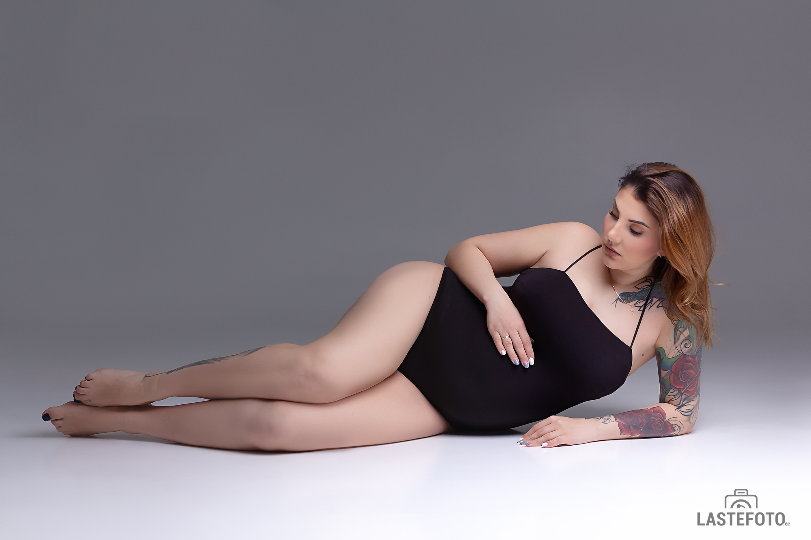
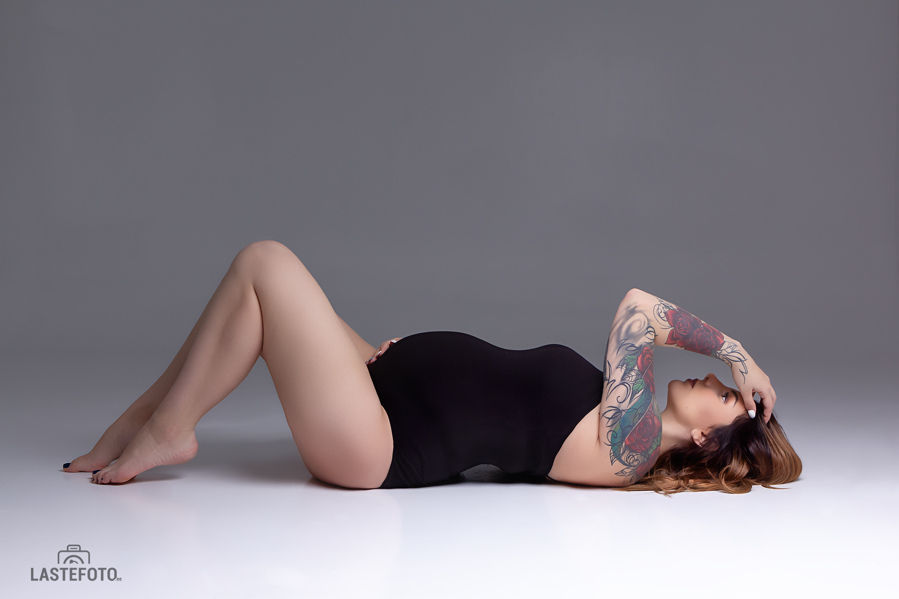
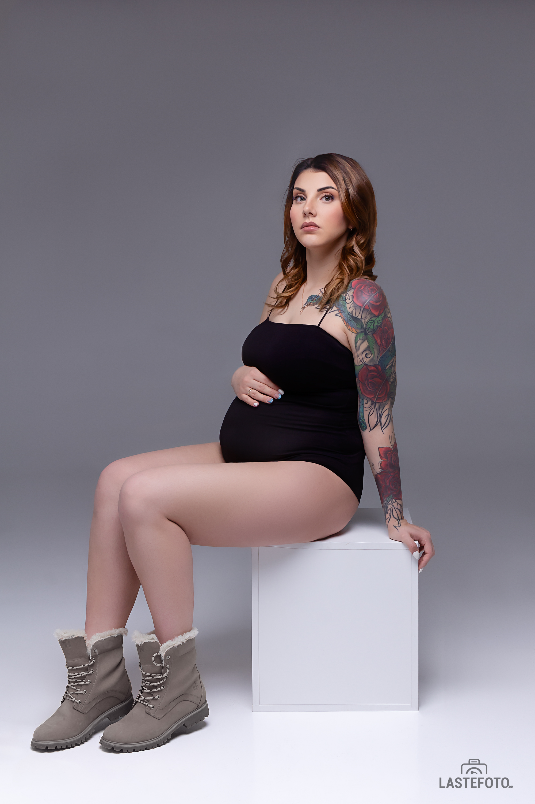
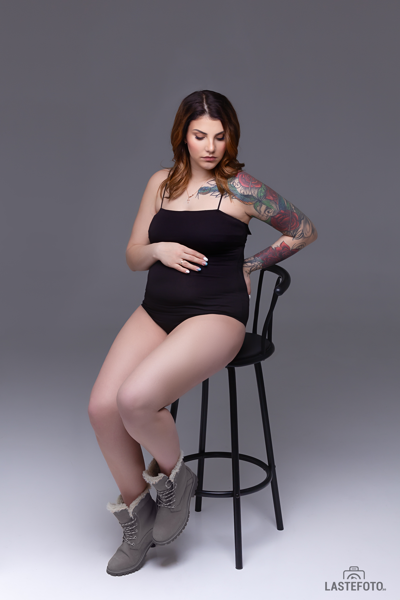
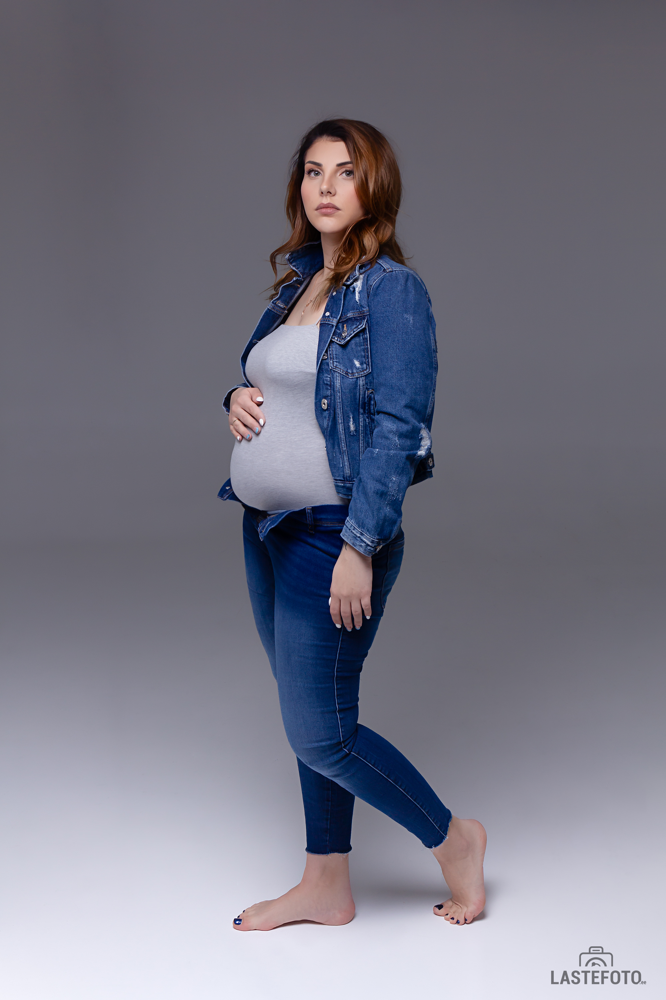
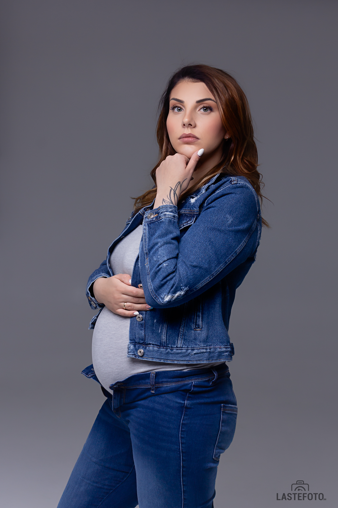

See on vä-ä-äga ilus: ainult tulevane ema ja kõhuke.
## Lakoonilised, stiilsed pildid ❤️

Seda kirjutades jooksevad mu nahale hanemunad: minu jaoks on raseduse pildistamine siiski eriline.

Ja kui see on ka elegantses Vogue stiilis, siis on see lihtsalt vaimustus!

Registreerusin veebikoolitusele selle suuna asutaja Sasha Bunaeva juures! Need pildid on tehtud koolituse raames.

Esimesene kodutöö ja esimesed valguse skeemid. Ma olen õnnelik ❤️

See on täpselt selline fotograafia, mis mulle väga meeldib ja mida ma tahan arendada ja tulevastele emadele pakkuda. 😍

Ees on veel kolm kodutööd ja diplomitöö, kuid saate juba praegu selles suunas fotosessiooni broneerida. Kui see on teie esimene rasedus, siis ootan teid, kui teil on 20–27 nädal.

See saab olema väga lahe, ma juba tunnen seda! ❤